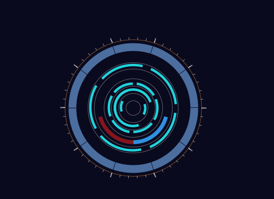

# SciFi UI Project

Name: Junhan Dang

Student Number: D18123630

# Description of the assignment
In this assignment we need to use the acknowledgethat  we have learnt in the class such as arrays variables and loops.to implement a sci-fi user interface using java processing.I've been thinking about this theme for a long time and finally decided to do my best to build a spaceship display system.

# Instructions
The system is not highly interactive and its function is mainly visual. The circle in the middle is a constant reminder that the energy is flowing properly and the ripples underneath are a constant reminder that the ship is running efficiently.

# How it works
The circle in the middle of the screen reflects the flow of energy throughout the flytron. It is realized with these codes.
     translate(width/2, height/2);
        

  
    
        noFill();
        stroke(255, 100);
        strokeWeight(1);
        ellipse(0, 0, 30, 30);
        ellipse(0, 0, 60, 60);
        ellipse(0, 0, 90, 90);
        ellipse(0, 0, 120, 120);
        ellipse(0, 0, 160, 160);
        ellipse(0, 0, 185, 185);
        //----------------------//
        stroke(33, 211, 219);
        strokeWeight(5);
        strokeCap(SQUARE);
        noFill();
        rotate(radians(frameCount*2));
        arc(0, 0, 50, 50, radians(0), radians(50));
        arc(0, 0, 50, 50, radians(180), radians(230));
        //---------------------//;
        stroke(33, 211, 219);
        strokeWeight(5);
        strokeCap(SQUARE);
        noFill();
        rotate(-radians(frameCount*10));
        arc(0, 0, 75, 75, radians(0), radians(180));
        arc(0, 0, 75, 75, radians(90), radians(270));
    
        stroke(33, 211, 219);
        strokeWeight(5);
        strokeCap(SQUARE);
        noFill();
        rotate(radians(frameCount*7));
        arc(0, 0, 100, 100, radians(0), radians(50));
        arc(0, 0, 100, 100, radians(60), radians(110));
        arc(0, 0, 100, 100, radians(120), radians(170));
        arc(0, 0, 100, 100, radians(180), radians(230));
        arc(0, 0, 100, 100, radians(240), radians(290));
        arc(0, 0, 100, 100, radians(300), radians(350));
    
        //-----------------------//
        stroke(33, 211, 219);
        strokeWeight(5);
        strokeCap(SQUARE);
        noFill();
        rotate(radians(frameCount/5));
        arc(0, 0, 175, 175, radians(0), radians(60));
        arc(0, 0, 175, 175, radians(72), radians(132));
        arc(0, 0, 175, 175, radians(144), radians(204));
        arc(0, 0, 175, 175, radians(216), radians(276));
        arc(0, 0, 175, 175, radians(288), radians(348));
# What I am most proud of in the assignment

What I am most pleased with and proud of in this task is the energy display system in the middle（circle）, which I think is a good representation of the Sci-fi element. When it rotates, it's like you can see for yourself how much energy is being used.

This is an image:

This is a youtube video:

This is a table:

| Heading 1 | Heading 2 |
|-----------|-----------|
|Junhan Dang| D18123630|

