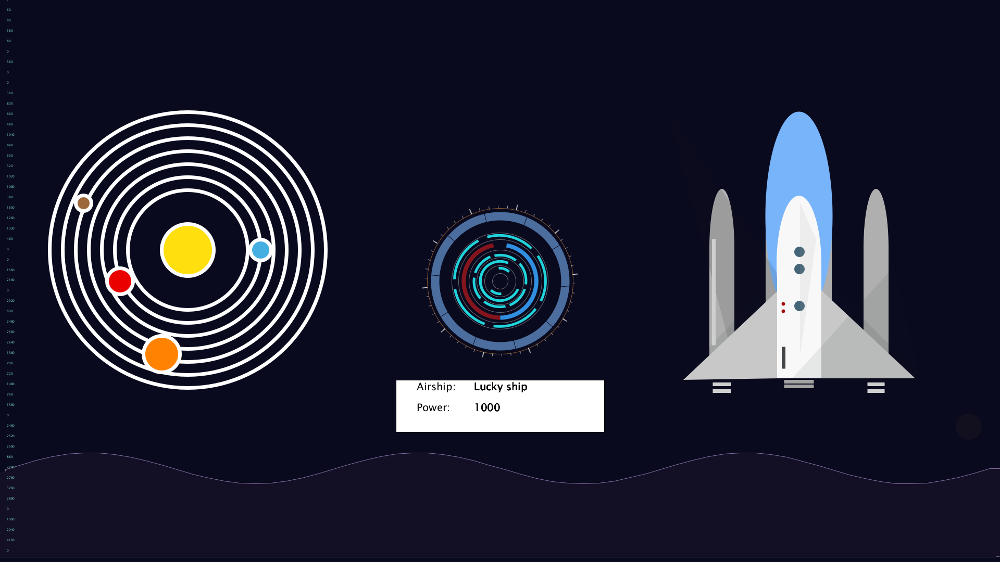

# SciFi UI Project

Name: Junhan Dang

Student Number: D18123630


# Description of the assignment
In this assignment we need to use the acknowledgethat  we have learnt in the class such as arrays variables and loops.to implement a sci-fi user interface using java processing.I've been thinking about this theme for a long time and finally decided to do my best to build a spaceship display system.

# Instructions

# How it works

# What I am most proud of in the assignment

# Markdown Tutorial

This is *emphasis*

This is a bulleted list

- Item
- Item

This is a numbered list

1. Item
1. Item

This is a [hyperlink](http://bryanduggan.org)

# Headings
## Headings
#### Headings
##### Headings

This is code:

```Java
public void render()
{
	ui.noFill();
	ui.stroke(255);
	ui.rect(x, y, width, height);
	ui.textAlign(PApplet.CENTER, PApplet.CENTER);
	ui.text(text, x + width * 0.5f, y + height * 0.5f);
}
```

So is this without specifying the language:

```
public void render()
{
	ui.noFill();
	ui.stroke(255);
	ui.rect(x, y, width, height);
	ui.textAlign(PApplet.CENTER, PApplet.CENTER);
	ui.text(text, x + width * 0.5f, y + height * 0.5f);
}
```

This is an image using a relative URL:



This is an image using an absolute URL:


This is a youtube video:

[](https://www.youtube.com/watch?v=J2kHSSFA4NU)

This is a table:

| Heading 1 | Heading 2 |
|-----------|-----------|
|Some stuff | Some more stuff in this column |
|Some stuff | Some more stuff in this column |
|Some stuff | Some more stuff in this column |
|Some stuff | Some more stuff in this column |

